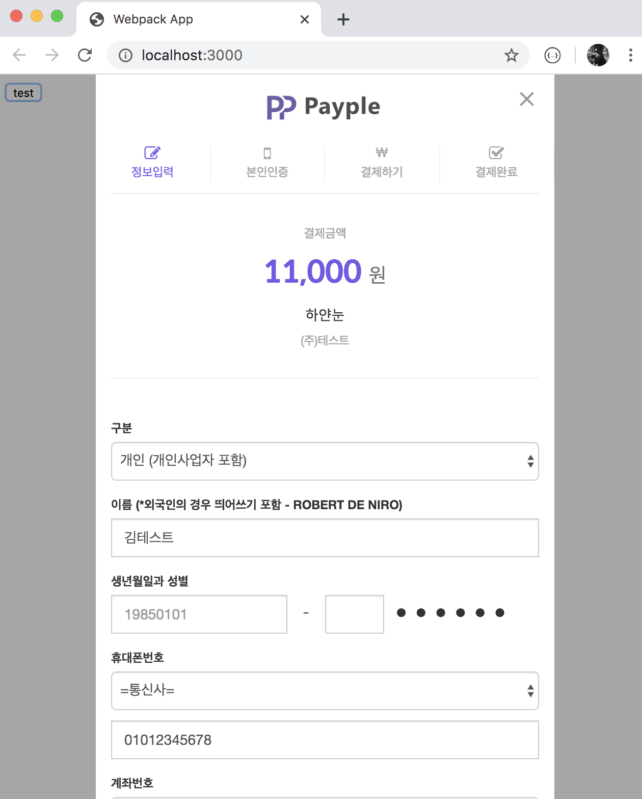

# payple-react

> 

[](https://www.npmjs.com/package/payple-react)

[](https://www.npmjs.com/package/payple-react)

## Install

```bash
npm install --save payple-react
```

## Usage

```jsx
import React from 'react'

import Payple from 'payple-react'

const data = {
    PCD_CST_ID: 'test',
    PCD_CUST_KEY: 'abcd1234567890',
    PCD_AUTH_URL: 'https://testcpay.payple.kr/php/auth.php',
    PCD_CPAY_VER: '1.0.1',
    PCD_PAY_TYPE: 'transfer',
    PCD_PAY_WORK: 'PAY',
    PCD_PAY_GOODS: '하얀눈',
    PCD_PAY_TOTAL: 11000,
    PCD_PAYER_NO: `payple_${ new Date().getMilliseconds() }`,
    PCD_PAY_ISTAX: 'N',
    PCD_PAYER_EMAIL: 'example@example.com',
    PCD_PAYER_NAME: '김테스트',
    PCD_PAYER_HP: '01012345678'
}
/* https://github.com/PAYPLECORP/manual
*/

(<Payple data={ data } onCallback= { (e) => console.log(e) }>
    <button>
        test
    </button>
</Payple>)
```

## Demo
